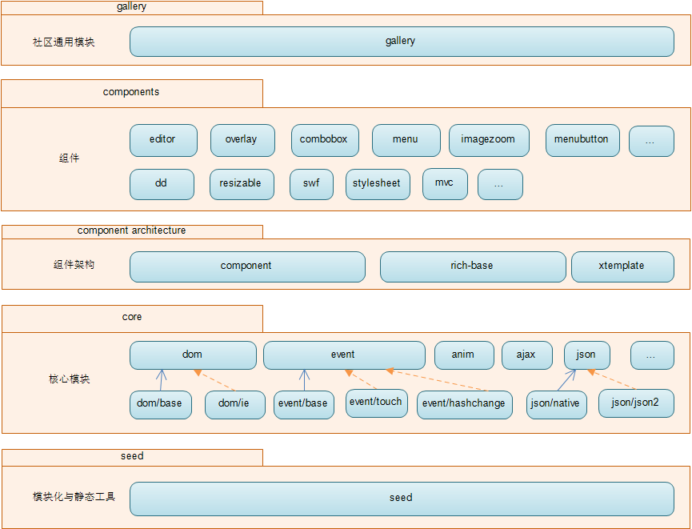

## overview

罗列一下备选的移动web开发类库，简单对比他们的加载，初始化时间

在实际应用中，去纠结某一个方法执行一万遍，不同类库性能上几毫秒的差异，意义不是特别大，目前美店的优化的方向还是减小类库体积，初始化时间。所以这里并没有参考网上的测试报告，感兴趣的可以点[这里](http://jsperf.com/)自行测试

- 自行测试结果如下

1. 手机端wifi下30次加载&执行时间统计如下
<table>
  <tr>
    <th>类库</th>
    <th>大小</th>
    <th>首次耗时</th>
    <th>平均耗时</th>
  </tr>
<tr>
  <td>jquery</td>
  <td>85k</td>
  <td>111ms</td>
  <td>71ms</td>
</tr>
<tr>
  <td>jquery-build</td>
  <td>50k</td>
  <td>79ms</td>
  <td>55ms</td>
</tr>
<tr>
  <td>zepto</td>
  <td>24k</td>
  <td>97ms</td>
  <td>38ms</td>
</tr>
<tr>
  <td>jquip</td>
  <td>32k</td>
  <td>69ms</td>
  <td>35ms</td>
</tr>
<tr>
  <td>sprint</td>
  <td>17k</td>
  <td>41ms</td>
  <td>34ms</td>
</tr>
<tr>
  <td>kissy-mini</td>
  <td>31k</td>
  <td>50ms</td>
  <td>27ms</td>
</tr>
<tr>
  <td>kissy-seed</td>
  <td>44k</td>
  <td>81ms</td>
  <td>57ms</td>
</tr>
</table>

## include

- 包含以下7个库
  
  + jquery
  
  + jquery(build)

  + zepto(build)

  + jquip

  + sprint

  + kissy mini

  + kissy seed

## detail

1. 执行 grunt，构建出需要的文件

1. 运行 python -m SimpleHTTPServer 起一个本地服务，手淘或其他浏览器访问该页面，页面将自动刷新10次，计算出脚本加载与执行的平均值。

1. 修改time.js的阈值以及setTimeout时间，可进行更多次加载，取的更精确的结果

***

#### jquery

jquery v2.1.4

- 手机端wifi下30次加载&执行时间
  
  + 首次耗时 111ms

  + 平均耗时 71ms

***

#### jquery-build

- 在gruntfile中增加要删除的模块，进入到目录执行grunt，文件会自动打包到lib文件夹，可使用 jquery-build.html 调试&查看效果

- 例如：不删除任何模块，打包后为84K。  删除  "ajax", "deprecated", "sizzle"后，打包后的文件体积减少到了58k

- 打开jquery API：[http://api.jquery.com/](http://api.jquery.com/) 在左侧的模块中，以下几个是支持移除的

  + `Ajax`

  + `CSS`

  + `Deprecated`

  + `Event Alias`

  + `Dimensions`

  + `Effects`

  + `Offset`

- 移除任何一个模块，这个模块里面对应的所有方法将不再可用

- 手机端wifi下30次加载&执行时间
  
  + 首次耗时 79ms

  + 平均耗时 55ms

***

#### zepto

- github [https://github.com/madrobby/zepto](https://github.com/madrobby/zepto)

- 官网 [http://zeptojs.com/](http://zeptojs.com/)

- zepto builder [http://github.e-sites.nl/zeptobuilder/](http://github.e-sites.nl/zeptobuilder/)

- zepto默认构建的库大小为24k（以前的版本好像是18左右）

- 默认安装以下几个模块

  + `zepto`

  + `event`

  + `ajax`

  + `form`

  + `ie`

- 执行 MODULES="zepto event ajax form iedetect fx fx_methods assets data callbacks deferred selector stack ios3" npm run-script dist 安装全部模块（看了一下，基本上都会用到，touch，gesture目前暂时需求，可以先移除），压缩前79.5k，压缩后为35k

- 手机端wifi下30次加载&执行时间
  
  + 首次耗时 97ms(24k看来foundation观望)

  + 平均耗时 38ms

  

***

#### jquip

- github [https://github.com/mythz/jquip](https://github.com/mythz/jquip)

- 非常小巧的jquery构建版本，号称实现了jquery 90%的功能，以下是它的组成

  + jquip.js (6.6k，最新版19k)
  
  + jquip.events.js (1k，最新版3k)
  
  + jquip.docready.js (.5k，最新版1k)
  
  + jquip.css.js (2.5k，最新版6k)
  
  + jquip.ajax.js (1k，最新版3k)

- 除此之外还有一些可选的选择器引擎，后期如果考虑自己实现jquery，可以借鉴

- 以上几个模块压缩版为32k

- 手机端wifi下30次加载&执行时间
  
  + 首次耗时 69ms

  + 平均耗时 35ms

  

***

#### sprint

- github [https://github.com/bendc/sprint](https://github.com/bendc/sprint)

- sprint提供常用的dom操作方法，体积非常小，压缩后的版本仅有17k，而且以官方提供的测试结果看，部分方法执行速度比jquery快，但是功能上有短板，如果替换为sprint，很多方法需要自行实现或另行选择框架

- 官网提供的完整压缩版为17k

- 手机端wifi下30次加载&执行时间
  
  + 首次耗时 41ms

  + 平均耗时 34ms

  

***

#### kissy mini

- github上搜到的是kissy mobile，不过官网打不开了，不知道是啥玩意儿，pass。找到一个替代的kissy mini  

- 官网戳[这里](http://m.kissyui.com/)

- kissy mini 好像没有在github上托管，放在他们自己的[gitlab](http://gitlab.alibaba-inc.com/kissy/m)上，但是这个gitlab是打不开的

- 提供3个版本

  + mini.js(8k，最新版31k)

  + mini-full.js(13k，最新版39k)

  + mini-all.js(34k)

- 以mini.js为例，手机端wifi下30次加载&执行时间
  
  + 首次耗时 50ms

  + 平均耗时 27ms

  

***

#### kissy seed

- github [https://github.com/kissyteam/kissy](https://github.com/kissyteam/kissy)

- API [http://docs.kissyui.com/1.4/docs/html/api/](http://docs.kissyui.com/1.4/docs/html/api/)

- seed是kissy的加载器，可以点击API查看，包含4个部分

  + lang——一个类似于underscore的工具库

  + features——环境检测，对H5的新API，css3动画的支持，有点类似于modernizr

  + loader——提供一个模块化开发的API

  + ua——顾名思义，useragent，可判断浏览器内核，手机型号等等

- 如果需要其他，比如操作dom，还得另行添加模块，可在bower.json里的dependencies中添加对应模块，执行bower install && node build，打包出自定义的seed.js

- 也可以自己定义模块，kissy提供了一个[KMD模块定义规范](http://docs.kissyui.com/1.4/docs/html/guideline/kmd.html)，根据规范定义自己的模块

- kissy也提供一个基于NodeJS的模块打包工具，点[这里](https://github.com/daxingplay/kmc)查看

- 目前单就kissy seed本身，代码量为44k;

- 下图为网摘的整个kissy框架的结构，值得学习

- 手机端wifi下30次加载&执行时间
  
  + 首次耗时 81ms

  + 平均耗时 57ms

  

## 小结

1. 手机端wifi下30次加载&执行时间统计如下
<table>
  <tr>
    <th>类库</th>
    <th>大小</th>
    <th>首次耗时</th>
    <th>平均耗时</th>
  </tr>
<tr>
  <td>jquery</td>
  <td>85k</td>
  <td>111ms</td>
  <td>71ms</td>
</tr>
<tr>
  <td>jquery-build</td>
  <td>50k</td>
  <td>79ms</td>
  <td>55ms</td>
</tr>
<tr>
  <td>zepto</td>
  <td>24k</td>
  <td>97ms</td>
  <td>38ms</td>
</tr>
<tr>
  <td>jquip</td>
  <td>32k</td>
  <td>69ms</td>
  <td>35ms</td>
</tr>
<tr>
  <td>sprint</td>
  <td>17k</td>
  <td>41ms</td>
  <td>34ms</td>
</tr>
<tr>
  <td>kissy-mini</td>
  <td>31k</td>
  <td>50ms</td>
  <td>27ms</td>
</tr>
<tr>
  <td>kissy-seed</td>
  <td>44k</td>
  <td>81ms</td>
  <td>57ms</td>
</tr>
</table>

1. 因为项目目前主要是重构，考虑到重构工作量以及jquery与kissy语法上的区别，还是用jquery系的类库替换jquery比较方便

1. 

1. 分析几个大型类库的API，虽然支持模块分解，但每个模块里面都有大量我们不会用到的代码，后期要将代码缩减到极致，最好的办法还是我们手动去写，网上也有很多实现的文章，如：

- [如何做到 jQuery-free?](http://www.ruanyifeng.com/blog/2013/05/jquery-free.html)

- [实现自己的Jquery之选择器](http://blog.csdn.net/hellomy/article/details/6332275)

