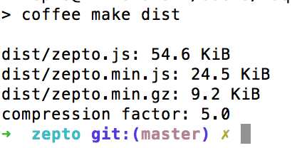
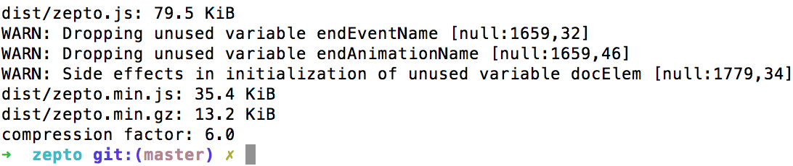

## overview

罗列一下备选的移动web开发类库，简单对比他们的加载，初始化时间

在实际应用中，去纠结某一个方法执行一万遍，不同类库性能上几毫秒的差异，意义不是特别大，目前美店的优化的方向还是减小类库体积，初始化时间，所以这里并没有参考网上的测试报告，感兴趣的可以点[这里](http://jsperf.com/)自行测试

## include

- 包含以下几个库
  
  + jquery
  
  + jquery-build

  + zepto-build

  + jquip

  + sprint

  + kissy mini

  + kissy seed

## detail

### jquery

jquery v2.1.4

### jquery-build

- 在gruntfile中增加要删除的模块，进入到目录执行grunt，文件会自动打包到lib文件夹，可使用 jquery-build.html 调试&查看效果

- 例如：不删除任何模块，打包后为84K。  删除  "ajax", "deprecated", "sizzle"后，打包后的文件体积减少到了58k

- 打开jquery API：[http://api.jquery.com/](http://api.jquery.com/) 在左侧的模块中，以下几个是支持移除的

  + `Ajax`

  + `CSS`

  + `Deprecated`

  + `Event Alias`

  + `Dimensions`

  + `Effects`

  + `Offset`

- 移除任何一个模块，这个模块里面对应的所有方法将不再可用

### zepto

- github [https://github.com/madrobby/zepto](https://github.com/madrobby/zepto)

- 官网 [http://zeptojs.com/](http://zeptojs.com/)

- zepto builder [http://github.e-sites.nl/zeptobuilder/](http://github.e-sites.nl/zeptobuilder/)

- zepto默认构建的库大小为24k（以前好像是18还是多少）

- 默认安装以下几个模块

  + `zepto`

  + `event`

  + `ajax`

  + `form`

  + `ie`

- 执行 MODULES="zepto event ajax form iedetect fx fx_methods assets data callbacks deferred selector stack ios3" npm run-script dist 安装全部模块（看了一下，基本上都会用到，touch，gesture目前暂时需求，可以先移除），压缩前79.5k，压缩后为35k

### jquip

- github [https://github.com/mythz/jquip](https://github.com/mythz/jquip)

- 非常小巧的jquery构建版本

### sprint

- github [https://github.com/bendc/sprint](https://github.com/bendc/sprint)

- sprint提供常用的dom操作方法，体积非常小，压缩后的版本仅有17k，而且以官方提供的测试结果看，部分方法执行速度比jquery快，但是功能上有短板，如果替换为sprint，很多方法需要自行实现

### kissy mini

- github上搜到的是kissy mobile，不过官网打不开了，不知道是啥玩意儿，pass。找到一个替代的kissy mini  官网戳[这里](http://m.kissyui.com/)

- kissy mini 好像没有在github上托管

- 提供3个版本

  + mini.js(8k)

  + mini-full.js(13k)

  + mini-all.js(34k)

### kissy seed

- github [https://github.com/kissyteam/kissy](https://github.com/kissyteam/kissy)

- API [http://docs.kissyui.com](http://docs.kissyui.com)

## 小结

- 因为项目目前主要是重构，考虑到重构工作量以及jquery与kissy语法上的区别，还是用jquery系的类库替换jquery比较方便

- 分析几个大型类库的API，虽然支持模块分解，但每个模块里面都有大量我们不会用到的代码，后期要将代码缩减到极致，最好的办法还是我们手动去写，网上也有很多实现的文章，如：

- [如何做到 jQuery-free?](http://www.ruanyifeng.com/blog/2013/05/jquery-free.html)

- [实现自己的Jquery之选择器](http://blog.csdn.net/hellomy/article/details/6332275)

